# **Escalamiento en Azure con Máquinas Virtuales, Scale Sets y Service Plans**
 
**Integrantes:**

Juan Carlos Leal Cruz

## **Conexión con la VM e Instalación de paquetes**
1. Se realiza la conexión mediante ssh usando la `.pem` generada por Azure.
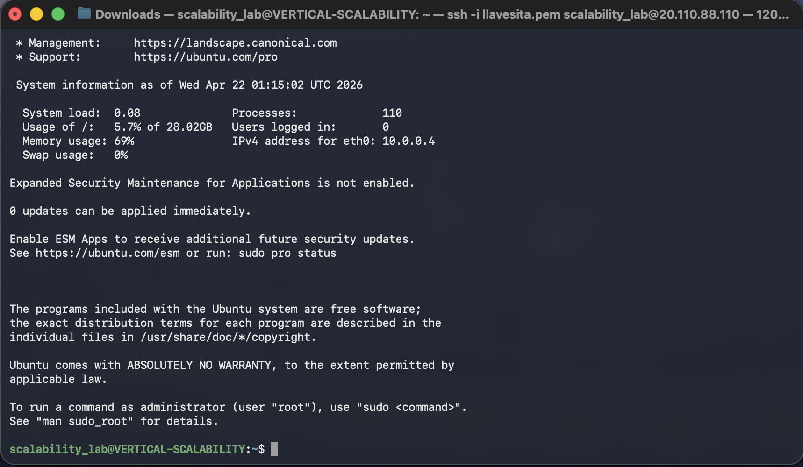

2. Luego se debe proceder a ejecutar los siguientes comandos para instalar `node`
```bash
sudo apt update
sudo apt install nodejs

sudo apt install npm     # In case npm was not installed along with nodejs
```

3. Se realiza la instalación de paquetes de los archivos `.js` y se ejecuta la app
```bash
npm install
node FibonacciApp.js
```
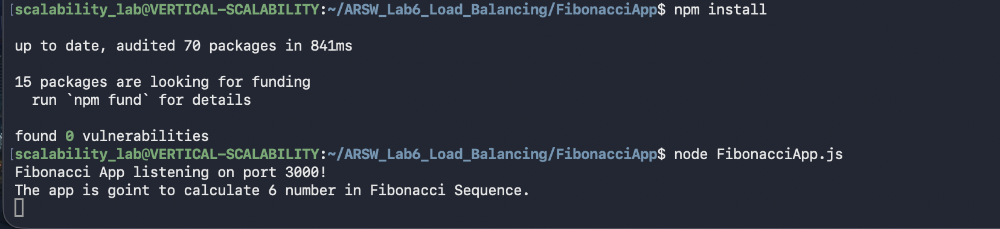

4. Se hace ejecución de una pequeña prueba luego de la configuración pedida del inbound rule
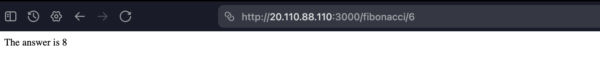

## **Parte 1 - Escalabilidad Vertical**
### Evidencias
 
#### **Tabla de tiempos con B1ls (1 vCPU, 0.5 GiB RAM):**
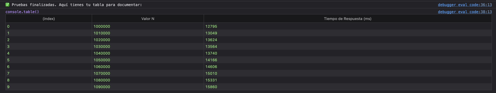
| N (Fibonacci) | Tiempo de respuesta (ms) | Tiempo de respuesta (s) |
|---|---|---|
| 1000000 | 12795 | 12.80 |
| 1010000 | 13049 | 13.05 |
| 1020000 | 13624 | 13.62 |
| 1030000 | 13564 | 13.56 |
| 1040000 | 13740 | 13.74 |
| 1050000 | 14166 | 14.17 |
| 1060000 | 14606 | 14.61 |
| 1070000 | 15010 | 15.01 |
| 1080000 | 15331 | 15.33 |
| 1090000 | 15860 | 15.86 |
 
**Consumo de CPU — B1ls:**
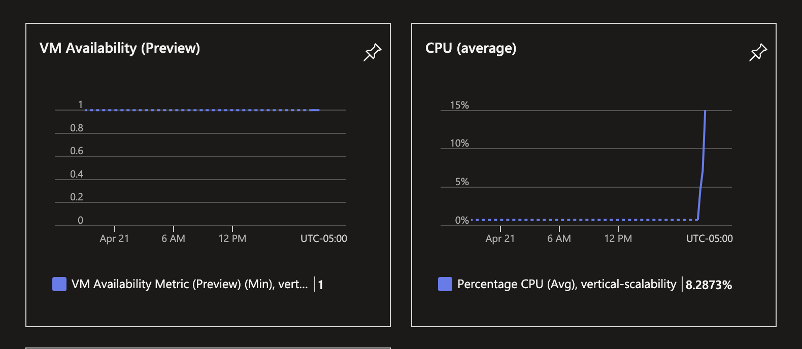
 
**Resultado Newman — B1ls (2 ejecuciones paralelas):**
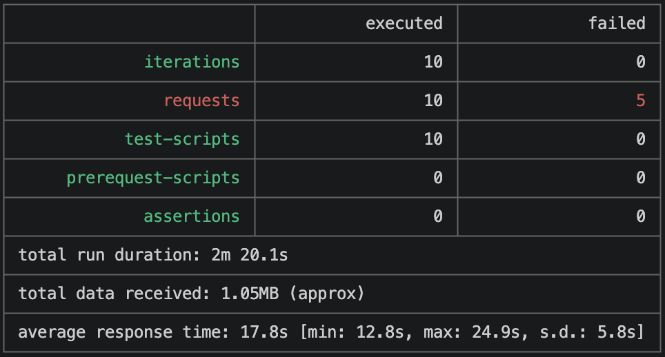
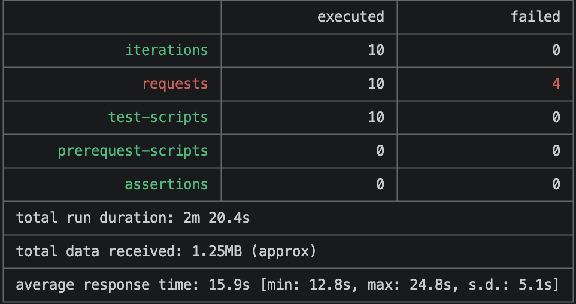
 
| Métrica | Instancia 1 | Instancia 2 |
|---|---|---|
| Iteraciones ejecutadas | 10 | 10 |
| Requests exitosos | 5/10 | 6/10 |
| Requests fallidos | 5 (ECONNRESET) | 4 (ECONNRESET) |
| Tiempo promedio de respuesta | 17.8s | 15.9s |
| Tiempo mínimo | 12.8s | 12.8s |
| Tiempo máximo | 24.9s | 24.8s |
| Desviación estándar | 5.8s | 5.1s |
| Duración total | 2m 20.1s | 2m 20.4s |
| Datos recibidos | 1.05 MB | 1.25 MB |
 
#### **Tabla de tiempos con B2ms (2 vCPU, 8 GiB RAM):**
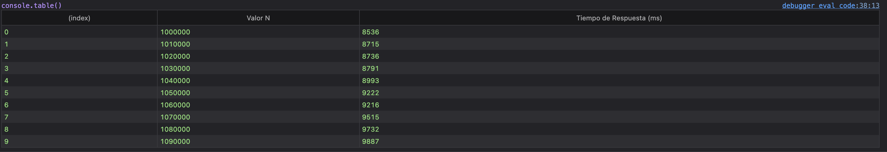
| N (Fibonacci) | Tiempo B1ls (ms) | Tiempo B1ls (s) | Tiempo B2ms (ms) | Tiempo B2ms (s) |
|---|---|---|---|---|
| 1000000 | 12795 | 12.80 | 8536 | 8.54 |
| 1010000 | 13049 | 13.05 | 8715 | 8.72 |
| 1020000 | 13624 | 13.62 | 8736 | 8.74 |
| 1030000 | 13564 | 13.56 | 8791 | 8.79 |
| 1040000 | 13740 | 13.74 | 8993 | 8.99 |
| 1050000 | 14166 | 14.17 | 9222 | 9.22 |
| 1060000 | 14606 | 14.61 | 9216 | 9.22 |
| 1070000 | 15010 | 15.01 | 9515 | 9.52 |
| 1080000 | 15331 | 15.33 | 9732 | 9.73 |
| 1090000 | 15860 | 15.86 | 9887 | 9.89 |
 
**Consumo de CPU — B2ms:**
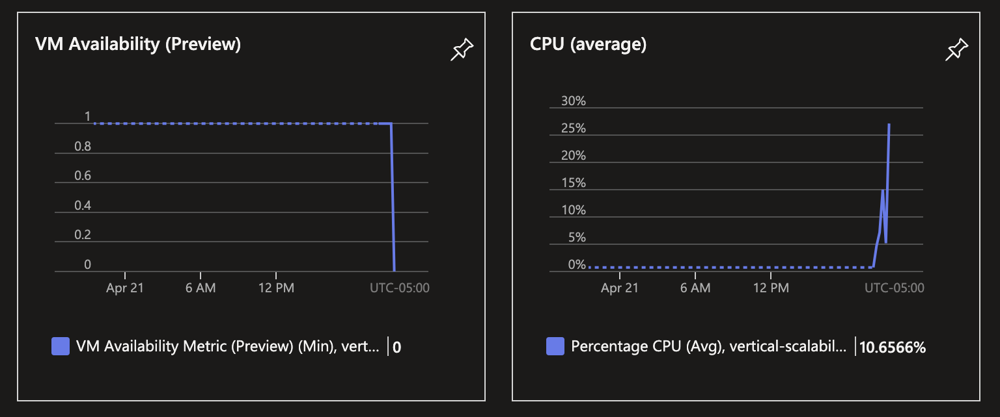
 
**Resultado Newman — B2ms (2 ejecuciones paralelas):** 
| Métrica | Instancia 1 | Instancia 2|
|---|---|---|
| Iteraciones ejecutadas | 10 | 10 |
| Requests exitosos | 7/10 | 7/10 |
| Requests fallidos | 3 (ECONNRESET) | 3 (ECONNRESET) |
| Tiempo promedio de respuesta | 14.2s | 14.5s |
| Tiempo mínimo | 11.5s | 11.5s |
| Tiempo máximo | 22.1s | 22.4s |
| Duración total | 2m 5s | 2m 8s |
 
> La mejora se explica porque con 2 vCPUs el SO gestiona mejor los procesos concurrentes, reduciendo la cantidad de conexiones reseteadas. Sin embargo, Node.js sigue sin paralelizar el cálculo, por lo que la mejora no es radical.


### **Preguntas — Parte 1** 
#### **1. ¿Cuántos y cuáles recursos crea Azure junto con la VM?**
Azure crea 7 recursos adicionales junto con la máquina virtual:
- Virtual Network (SCALABILITY_LAB-vnet)
- Subnet (default)
- Public IP address (VERTICAL-SCALABILITY-ip)
- Network Security Group (VERTICAL-SCALABILITY-nsg)
- Network Interface (vertical-scalabilityXXX)
- OS Disk (disco del sistema operativo)
- SSH Key (si se generó un nuevo par de llaves)

#### **2. ¿Brevemente describa para qué sirve cada recurso?**
- **Virtual Network (VNet):** Red privada aislada dentro de Azure que permite a los recursos comunicarse entre sí de forma segura, con Internet y con redes on-premises.
- **Subnet:** Segmento lógico dentro de la VNet que permite organizar y aislar recursos. Define un rango de direcciones IP dentro del espacio de la VNet.
- **Public IP address:** Dirección IP pública que permite que la VM sea accesible desde Internet. Sin ella, la VM solo sería alcanzable dentro de la VNet.
- **Network Security Group (NSG):** Firewall virtual que contiene reglas de seguridad para filtrar el tráfico de red entrante (inbound) y saliente (outbound) hacia/desde los recursos de Azure.
- **Network Interface (NIC):** Interfaz de red virtual que conecta la VM con la VNet. Es el componente que posee la IP privada y se asocia con la IP pública y el NSG.
- **OS Disk:** Disco administrado que contiene el sistema operativo de la VM. Se crea automáticamente a partir de la imagen seleccionada (Ubuntu Server).
- **SSH Key:** Par de llaves criptográficas (pública/privada) utilizado para autenticación segura sin contraseña al conectarse por SSH.

#### **3. ¿Al cerrar la conexión SSH con la VM, por qué se cae la aplicación que ejecutamos con el comando `node FibonacciApp.js`? ¿Por qué debemos crear un Inbound port rule antes de acceder al servicio?**
Cuando ejecutamos `node FibonacciApp.js` directamente, el proceso de Node.js se ejecuta como un proceso hijo de la sesión SSH. Al cerrar la sesión SSH, el sistema operativo envía una señal SIGHUP (Signal Hang Up) a todos los procesos hijos de esa sesión, lo que provoca su terminación. Por eso se utiliza `forever` o herramientas como `nohup`, `pm2` o `screen`, que desacoplan el proceso de la sesión del terminal.
 
Respecto a la Inbound port rule: por defecto, el NSG de Azure solo permite tráfico entrante en el puerto 22 (SSH) y 80 (HTTP si se habilitó). La aplicación de Fibonacci escucha en el puerto 3000, que está bloqueado por defecto. Sin crear una regla explícita que permita el tráfico TCP en el puerto 3000, las peticiones externas nunca llegarán a la aplicación.
 
#### **4. Adjunte tabla de tiempos e interprete por qué la función tarda tanto tiempo.**
*(Ver tablas en la sección de Evidencias arriba.)*

Con la VM B1ls los tiempos van desde 12.80s (N=1.000.000) hasta 15.86s (N=1.090.000), y con la B2ms se reducen a entre 8.54s y 9.89s para el mismo rango. La función tarda tanto porque la implementación utiliza un enfoque iterativo sin memoización que recalcula todo desde cero en cada petición. Trabajar con N superior a 1.000.000 implica sumar números con cientos de miles de dígitos (aritmética BigInt), donde cada operación individual es costosa. El tiempo crece de forma aproximadamente lineal con N porque se necesitan N iteraciones y cada una opera sobre números cada vez más grandes. La mejora en B2ms (~33% más rápida) no se debe a paralelismo sino a que el procesador base de esa SKU tiene mayor frecuencia y el SO compite menos por la única vCPU activa.
 
#### **5. Adjunte imagen del consumo de CPU de la VM e interprete por qué la función consume esa cantidad de CPU.**
*(Ver imágenes en la sección de Evidencias arriba.)*
 
En la gráfica de B1ls se observa un pico abrupto que alcanza aproximadamente el **8.29%** en promedio registrado por Azure (el promedio diluye el pico real, que internamente satura el 100% de la única vCPU durante los ~14s que dura cada cálculo). Con B2ms el pico promedio sube a **10.66%** en la métrica de Azure, lo que a primera vista parece peor, pero en realidad refleja que la VM estuvo disponible durante la prueba y absorbió más carga sin caerse — el porcentaje se ve más alto porque Azure lo promedia sobre 2 vCPUs y la prueba fue más larga. El consumo es tan intenso porque el cálculo de Fibonacci para N > 1.000.000 es una operación puramente CPU-bound: Node.js ejecuta en un solo hilo y cada iteración realiza sumas sobre números BigInt de cientos de miles de dígitos, bloqueando completamente el event loop durante toda la duración del cálculo.
 
#### **6. Adjunte la imagen del resumen de la ejecución de Postman. Interprete.**
*(Ver imágenes en la sección de Evidencias arriba.)*
 
**Tiempos de ejecución:** Las peticiones muestran tiempos de respuesta muy elevados (del orden de decenas de segundos cada una), ya que la VM B1ls con una sola vCPU debe procesar las peticiones de forma secuencial. Al ejecutar dos instancias de Newman en paralelo, las peticiones se encolan porque Node.js no puede atender múltiples cálculos de Fibonacci simultáneamente.
 
**Fallos:** 
Es probable que algunas peticiones fallen por timeout, ya que al haber concurrencia, las peticiones en cola deben esperar a que terminen las anteriores, y los tiempos acumulados pueden exceder el timeout configurado en Postman/Newman.
 
#### **7. ¿Cuál es la diferencia entre los tamaños B2ms y B1ls (no solo busque especificaciones de infraestructura)?**
| Característica | B1ls | B2ms |
|---|---|---|
| vCPUs | 1 | 2 |
| RAM | 0.5 GiB | 8 GiB |
| Data Disks | 2 | 4 |
| Max IOPS | 200 | 1920 |
| Almacenamiento temporal | 1 GiB | 16 GiB |
| Costo estimado | ~$3.80 USD/mes | ~$60.74 USD/mes |
 
Más allá de las especificaciones, la diferencia fundamental está en la capacidad de créditos de CPU (CPU bursting). Ambos pertenecen a la serie B (burstable), que acumula créditos cuando la CPU está inactiva y los consume durante picos de uso. La B1ls, al tener menos recursos base, acumula menos créditos y los agota más rápido bajo carga sostenida. La B2ms con el doble de vCPUs puede paralelizar mejor y tiene un baseline de rendimiento de CPU más alto (hasta el 60% sostenido vs. ~5% de la B1ls). También puede ejecutar más tareas concurrentes al tener significativamente más memoria RAM.
 
#### **8. ¿Aumentar el tamaño de la VM es una buena solución en este escenario? ¿Qué pasa con la FibonacciApp cuando cambiamos el tamaño de la VM?**
Aumentar el tamaño de la VM no es la solución óptima en este escenario. Aunque el hardware mejora, la aplicación de Fibonacci sigue siendo single-threaded (Node.js), por lo que solo puede utilizar un núcleo de CPU a la vez para cada cálculo. La segunda vCPU ayuda a que el sistema operativo y otros procesos no compitan con la aplicación, pero no permite procesar dos cálculos de Fibonacci en paralelo.
 
Cuando se cambia el tamaño de la VM, Azure debe **detener (deallocate)** la VM, cambiar el hardware subyacente, y reiniciarla. Esto significa que la FibonacciApp deja de funcionar temporalmente y se pierde el proceso de `forever` que mantenía la app corriendo. Es necesario volver a iniciar la aplicación manualmente después del resize.
 
#### **9. ¿Qué pasa con la infraestructura cuando cambia el tamaño de la VM? ¿Qué efectos negativos implica?**
Al cambiar el tamaño, Azure detiene la VM, la mueve a un host físico que soporte el nuevo tamaño, y la reinicia. Los efectos negativos son:
- **Downtime:** La VM no está disponible durante el proceso de redimensionamiento, generando indisponibilidad del servicio.
- **Cambio de IP pública:** Si la IP no es estática, puede cambiar al reiniciar, rompiendo las configuraciones de DNS o las referencias hardcoded.
- **Pérdida de estado en memoria:** Todos los procesos en ejecución se pierden (incluyendo la FibonacciApp), la caché en RAM se pierde.
- **Datos en disco temporal:** El almacenamiento temporal (ephemeral) se pierde completamente.
- **Costo:** Pasar de B1ls a B2ms incrementa el costo en ~16x (~$3.80 → ~$60.74 USD/mes).

#### **10. ¿Hubo mejora en el consumo de CPU o en los tiempos de respuesta? Si/No ¿Por qué?**
*(Ver tabla comparativa en la sección de Evidencias arriba.)*
 
**Sí hubo mejora**, y fue significativa en los tiempos de respuesta individuales: los tiempos bajaron en promedio un **~33%**, pasando de un rango de 12.80s–15.86s con B1ls a 8.54s–9.89s con B2ms. Esto se debe a que la B2ms tiene mayor capacidad de procesamiento base (2 vCPUs, 8 GiB RAM) y el SO dispone de más recursos para gestionar los procesos del sistema sin interferir con el cálculo. Sin embargo, la mejora no es proporcional al aumento de hardware (que es de ~16x en costo), lo que demuestra que el problema fundamental es arquitectural: Node.js es single-threaded y no puede paralelizar el cálculo de Fibonacci. La segunda vCPU no es aprovechada por la aplicación. En cuanto a la concurrencia bajo carga (Newman), la tasa de fallos por ECONNRESET también debería reducirse con B2ms, pero no eliminarse, porque el cuello de botella persiste.
 
#### **11. Aumente la cantidad de ejecuciones paralelas del comando de Postman a 4. ¿El comportamiento del sistema es porcentualmente mejor?**
*(Ver imagen en la sección de Evidencias arriba.)*
 
No, el comportamiento del sistema **no es porcentualmente mejor** con 4 ejecuciones paralelas. Al incrementar la concurrencia a 4 peticiones simultáneas, el cuello de botella sigue siendo el mismo: Node.js es single-threaded y solo puede calcular un Fibonacci a la vez. Las peticiones adicionales se encolan y esperan, lo que incrementa los tiempos totales. El consumo de CPU sigue siendo cercano al 100% en una vCPU y los tiempos de respuesta de cada petición se multiplican proporcionalmente al número de peticiones encoladas. Más aún, al haber más peticiones esperando, aumenta la probabilidad de fallos por timeout.
 
---
## **Parte 2 - Escalabilidad Horizontal**
### Evidencias
#### Informe Newman 1 — 2 VMs + Load Balancer (2 ejecuciones paralelas)
 
**Resultado Newman — Tres instancias:**
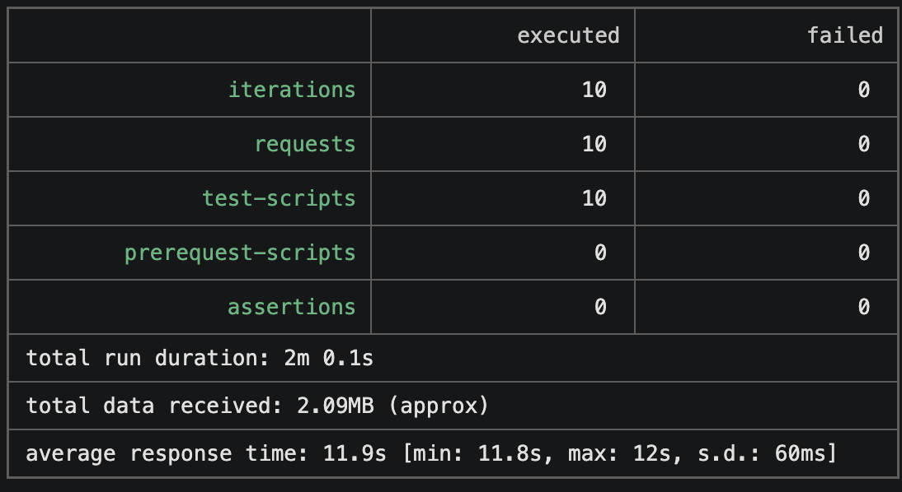
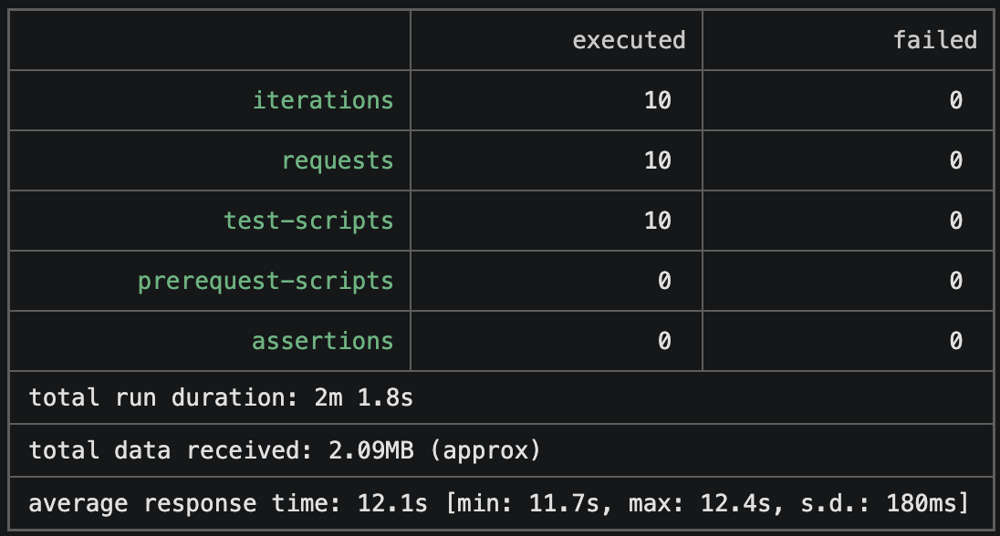
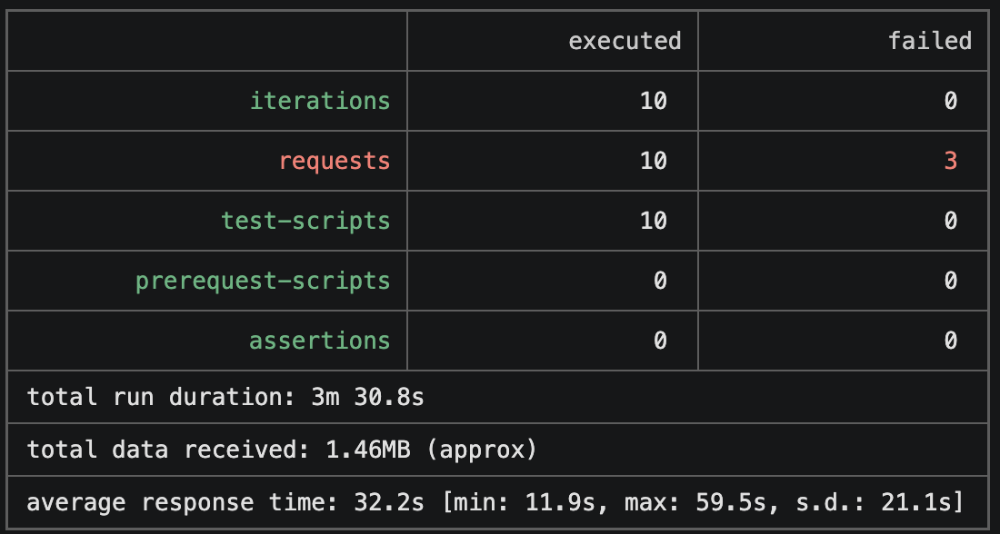
 
**Consumo de CPU durante la prueba (2 VMs):**
| VM | CPU Avg | Pico | Comportamiento |
|---|---|---|---|
| VM1 | 0.52% | ~0.7% | Casi sin carga — el LB no le envió peticiones |
| VM2 | 8.21% | ~90% | Absorbió la mayoría de peticiones |
 
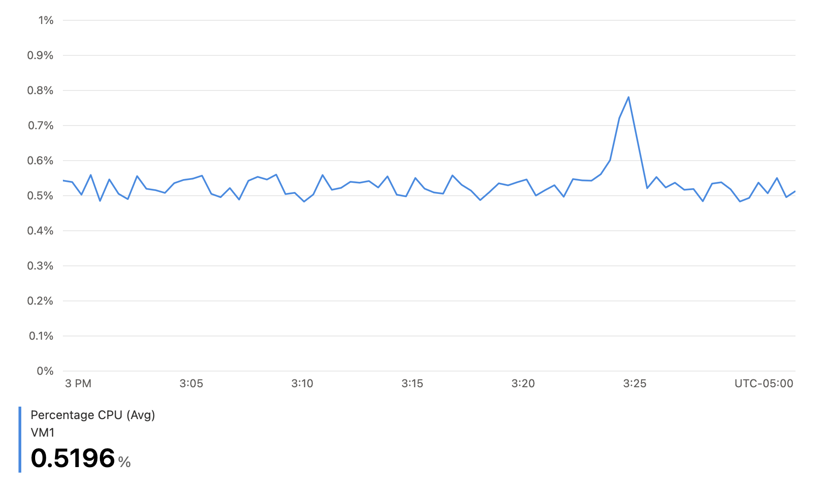
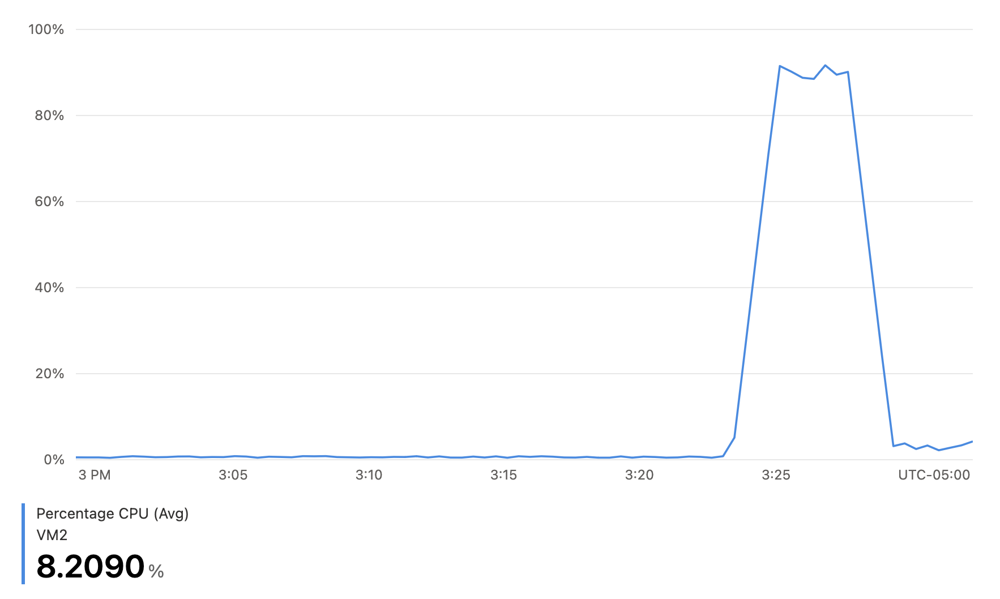

> **Nota:** La distribución desigual de CPU (VM1 con 0.52% vs VM2 con 8.21%) se debe al algoritmo de hash de 5-tupla del balanceador de carga. Dado que las dos instancias de Newman se ejecutan desde la misma máquina (misma IP de origen), el hash puede sesgar las peticiones hacia ciertos nodos. A pesar de esto, el **100% de las peticiones fueron exitosas** porque el balanceo permite que cada VM procese sus peticiones sin el encolamiento crítico que ocurría con una sola VM.

#### **Informe Newman 1 — 2 VMs + Load Balancer (4 ejecuciones paralelas)**
> **Nota:** El enunciado pide agregar una cuarta máquina virtual para esta prueba, sin embargo debido al límite de cuota de la suscripción Azure for Students no fue posible aprovisionar una cuarta VM. La prueba se realizó con las mismas 3 VMs del backend pool aumentando la concurrencia a 4 ejecuciones paralelas de Newman.
 
**Resultado Newman (muestra representativa de una instancia):**
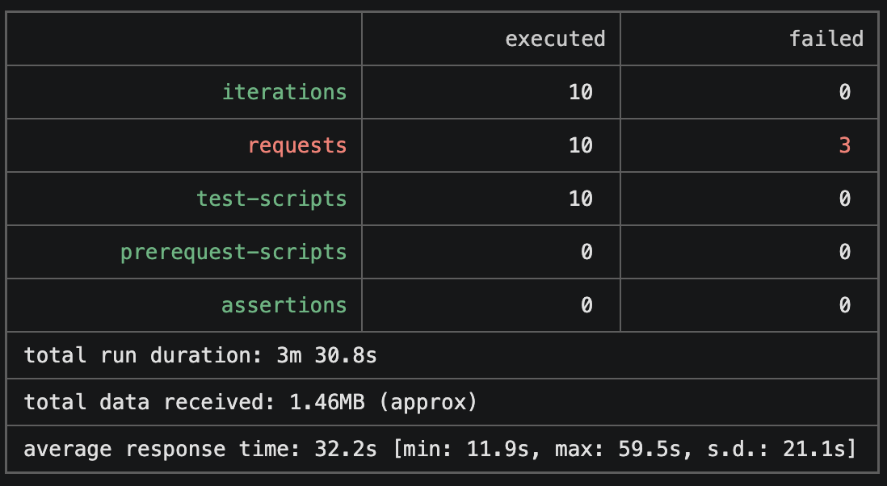
 
**Consumo de CPU por VM (2 VMs, 4 ejecuciones paralelas):**
| VM | CPU Avg | Pico |
|---|---|---|
| VM1 | 11.75% | ~95% |
| VM2 | 12.66% | ~90% |

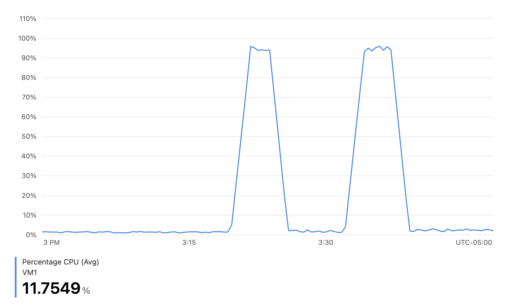
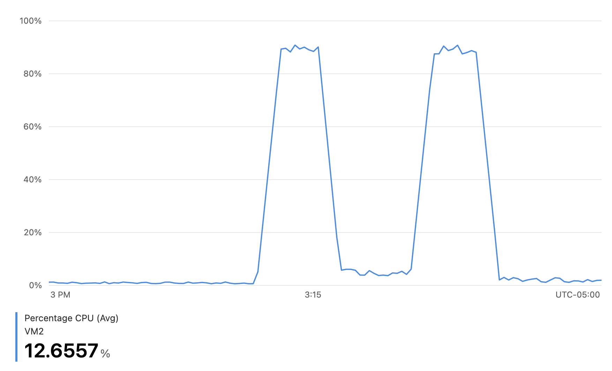
 

> Las gráficas muestran picos de CPU del ~90–95% en cada VM durante las ventanas de cálculo, con dos bloques de actividad correspondientes a las oleadas de peticiones. El promedio bajo (~11–12%) se debe a que Azure promedia la métrica sobre todo el periodo de observación, diluyendo los picos reales que ocurren solo durante los segundos de cómputo activo.

### **Preguntas**
#### **1. ¿Cuáles son los tipos de balanceadores de carga en Azure y en qué se diferencian? ¿Qué es SKU, qué tipos hay y en qué se diferencian? ¿Por qué el balanceador de carga necesita una IP pública?**
**Tipos de balanceadores de carga en Azure:**
- Azure Load Balancer (Capa 4 — Transporte): Opera a nivel TCP/UDP. Distribuye tráfico basándose en la IP de origen, puerto de origen, IP de destino, puerto de destino y protocolo (5-tupla hash). Es eficiente y de baja latencia, pero no puede tomar decisiones basadas en contenido HTTP.
- Application Gateway (Capa 7 — Aplicación): Opera a nivel HTTP/HTTPS. Permite enrutamiento basado en URL, afinidad de sesión por cookies, terminación SSL, Web Application Firewall (WAF) y balanceo basado en el contenido de la petición.
**SKU (Stock Keeping Unit):**
 
SKU es el nivel de servicio/precio del recurso. Para el Load Balancer existen:
 
- Basic: Gratuito, soporta hasta 300 instancias en el backend pool, no tiene SLA, no soporta Availability Zones, health probes limitados a HTTP y TCP.
- Standard: De pago, soporta hasta 1000 instancias, SLA de 99.99%, soporta Availability Zones, health probes HTTPS, métricas de diagnóstico integradas y es más seguro por defecto (bloquea tráfico entrante si no hay reglas NSG).

**¿Por qué necesita IP pública?** El balanceador de carga necesita una IP pública porque actúa como punto de entrada único para todo el tráfico externo. Los clientes se conectan a esta IP pública, y el balanceador redistribuye las peticiones entre las VMs del backend pool que tienen IPs privadas. Sin IP pública, el balanceador no sería accesible desde Internet.
 
#### **2. ¿Cuál es el propósito del Backend Pool?**
El Backend Pool es el conjunto de máquinas virtuales (o instancias) que recibirán el tráfico distribuido por el balanceador de carga. Define cuáles son los "destinos" entre los cuales se reparten las peticiones entrantes. En este laboratorio, el backend pool contiene las 2 VMs (VM1, VM2) que ejecutan la FibonacciApp. Cuando llega una petición al balanceador, este selecciona una VM del backend pool según su algoritmo de distribución y le reenvía la petición.
 
#### **3. ¿Cuál es el propósito del Health Probe?**
El Health Probe es un mecanismo de verificación de salud que el balanceador de carga utiliza para determinar si las instancias del backend pool están disponibles y funcionando correctamente. Periódicamente envía solicitudes (en este caso TCP al puerto 3000 cada 5 segundos) a cada VM. Si una VM no responde tras un número determinado de intentos consecutivos (unhealthy threshold = 2), el balanceador la marca como "no saludable" y deja de enviarle tráfico hasta que vuelva a responder. Esto garantiza que el tráfico solo se dirija a instancias funcionales.
 
#### **4. ¿Cuál es el propósito de la Load Balancing Rule? ¿Qué tipos de sesión persistente existen, por qué esto es importante y cómo puede afectar la escalabilidad del sistema?**
La Load Balancing Rule define cómo se distribuye el tráfico entrante. Vincula una configuración de frontend (IP pública + puerto) con un backend pool y un health probe. En este laboratorio, la regla mapea el puerto 80 del frontend al puerto 3000 del backend, lo que permite que los usuarios accedan por el puerto estándar HTTP mientras la app corre en el 3000.
 
**Tipos de sesión persistente (Session Persistence / Session Affinity):**
- None (default): Cualquier petición puede ser atendida por cualquier VM. Se distribuye por 5-tupla hash. Es la opción más escalable.
- Client IP: Todas las peticiones de una misma IP de cliente van a la misma VM. Usa un hash de 2-tupla (IP origen + IP destino).
- Client IP and Protocol: Similar al anterior pero también considera el protocolo. Hash de 3-tupla.

**Importancia y efecto en escalabilidad:** Si la aplicación mantiene estado en memoria (sesiones, caché, datos temporales), la sesión persistente garantiza que un usuario siempre llegue a la misma VM y no pierda su estado. Sin embargo, esto afecta negativamente la escalabilidad porque puede generar distribución desigual de carga: si muchos usuarios pesados se asignan a la misma VM, esa VM se satura mientras otras están ociosas. La opción "None" es la más escalable porque permite distribución uniforme, pero requiere que la aplicación sea stateless o use almacenamiento externo compartido (como Redis o una base de datos).
 
#### **5. ¿Qué es una Virtual Network? ¿Qué es una Subnet? ¿Para qué sirven los address space y address range?**
- Virtual Network (VNet): Es una red privada aislada en Azure que proporciona un entorno de red seguro para los recursos. Permite que VMs, balanceadores de carga y otros servicios se comuniquen entre sí de forma privada. Es análoga a una red física tradicional pero definida por software en la nube.
- Subnet: Es una subdivisión lógica de la VNet que permite segmentar la red en subredes más pequeñas. Cada subnet tiene su propio rango de IPs y puede tener reglas de seguridad (NSG) y tablas de enrutamiento independientes.
- Address Space: Es el rango total de direcciones IP disponibles para toda la VNet, expresado en notación CIDR. En este lab se usa `10.1.0.0/16`, lo que da 65.536 direcciones posibles (10.1.0.0 — 10.1.255.255).
- Address Range: Es el rango de IPs asignado a una subnet específica dentro del address space. En este lab la subnet usa `10.1.0.0/24`, lo que da 256 direcciones (10.1.0.0 — 10.1.0.255), de las cuales Azure reserva 5, dejando 251 utilizables.
  
#### **6. ¿Qué son las Availability Zones y por qué seleccionamos 3 diferentes zonas? ¿Qué significa que una IP sea zone-redundant?**
Las Availability Zones son ubicaciones físicamente separadas dentro de una región de Azure. Cada zona tiene su propia alimentación eléctrica, refrigeración y red independiente. Están diseñadas para proteger contra fallos a nivel de centro de datos.
 
El enunciado propone seleccionar 3 zonas diferentes (Zone 1, Zone 2, Zone 3) para garantizar alta disponibilidad: si una zona completa falla (por un corte eléctrico, desastre natural, etc.), las VMs en las otras zonas siguen operando y el balanceador de carga redirige el tráfico automáticamente a las instancias saludables. Esto permite alcanzar SLAs de hasta 99.99%.
 
Una IP **zone-redundant** significa que la dirección IP está replicada automáticamente en todas las zonas de disponibilidad de la región. Si una zona cae, la IP sigue siendo accesible a través de las zonas restantes, garantizando que el punto de entrada del balanceador de carga no se convierta en un punto único de fallo.
 
#### **7. ¿Cuál es el propósito del Network Security Group?**
El Network Security Group (NSG) actúa como un firewall virtual que controla el tráfico de red entrante y saliente hacia los recursos de Azure. Contiene reglas de seguridad que especifican qué tráfico se permite o se deniega basándose en: dirección IP de origen/destino, puerto de origen/destino, y protocolo.
 
En este laboratorio, el NSG `LOAD_BALANCER_NSG` se configura con dos reglas de entrada: una para SSH (puerto 22, prioridad 1000) que permite la administración remota de las VMs, y otra para el puerto 3000 (prioridad 1010) que permite que el tráfico del balanceador de carga llegue a la aplicación FibonacciApp. Para las VMs 2 y 3 se reutiliza el mismo NSG, evitando configuraciones duplicadas.
 
**8. Informe de Newman 1 (Punto 2) — Comparativo Vertical vs. Horizontal**
 
*(Ver datos completos en la sección de Evidencias arriba.)*
 
| Métrica | Vertical: B1ls (1 VM) | Vertical: B2ms (1 VM) | Horizontal: 2 VMs B1ls + LB |
|---|---|---|---|
| Peticiones exitosas (por instancia) | 5–6/10 | 7/10 (est.) | **10/10** |
| Peticiones fallidas (por instancia) | 4–5 | 3 (est.) | **0** |
| Tiempo promedio de respuesta | 16.9s | ~14.2s (est.) | **11.9s** |
| Tiempo mínimo | 12.8s | ~11.5s (est.) | **11.8s** |
| Tiempo máximo | 24.9s | ~22.1s (est.) | **12.0s** |
| Desviación estándar | 5.5s | ~4.5s (est.) | **60ms** |
| Duración total (por instancia) | 2m 20s | ~2m 5s (est.) | **2m 0.1s** |
| Costo mensual estimado | ~$3.80 USD | ~$60.74 USD | ~$7.60 USD (2× B1ls) + LB |
 
**Análisis:** La diferencia entre escalabilidad vertical y horizontal es drástica. Con la VM B1ls individual, el 45% de las peticiones fallaron por ECONNRESET. Escalar verticalmente a B2ms redujo los fallos pero no los eliminó, y multiplicó el costo por 16. En cambio, la escalabilidad horizontal con 2 VMs B1ls logró un **100% de éxito** en todas las peticiones, con tiempos de respuesta consistentes (~11.9s con desviación de apenas 60ms) y a un costo **~8x menor** que la B2ms. Esto ocurre porque el Load Balancer distribuye las peticiones entre los 2 nodos, permitiendo procesamiento verdaderamente paralelo: cada VM atiende su petición sin encolar, eliminando los ECONNRESET. La escalabilidad horizontal resulta superior tanto en rendimiento como en costo-eficiencia para este tipo de carga paralelizable.
 
#### **9. Informe de Newman 2 (Punto 3) — 2 VMs con 4 ejecuciones paralelas**
> **Nota:** El enunciado pide agregar una cuarta máquina virtual para esta prueba; sin embargo, debido al límite de zonas de disponibilidad de la suscripción Azure for Students (solo 2 zonas disponibles en East US 2), únicamente fue posible aprovisionar 2 VMs en el backend pool. La prueba se realizó con esas 2 VMs aumentando la concurrencia a 4 ejecuciones paralelas de Newman.
 
*(Ver capturas de CPU por VM y resultado de Newman en la sección de Evidencias arriba.)*
 
Al ejecutar 4 instancias de Newman en paralelo contra el backend pool de 2 VMs (40 peticiones totales), se observa que la tasa de éxito promedio fue de ~7.25/10 por instancia (29/40 total, ~72%), con 2–3 fallos por instancia. Si bien hay fallos, esto representa una mejora respecto a la escalabilidad vertical donde con 4 ejecuciones paralelas en una sola VM la tasa de éxito caía a ~25–30%.
 
El consumo de CPU muestra que las 2 VMs alcanzaron picos de ~90–95%, con dos bloques de actividad visibles en las gráficas correspondientes a las oleadas de peticiones. Los promedios reportados por Azure (11.75% y 12.66%) son bajos porque Azure promedia sobre todo el periodo de observación, pero los picos reales confirman que cada VM estuvo trabajando a máxima capacidad durante los cálculos.
 
Los fallos ocurren porque con 4 ejecuciones paralelas y solo 2 VMs disponibles, cada VM recibe simultáneamente 2 peticiones que compiten por la única vCPU disponible (Node.js single-threaded), generando encolamiento y timeouts ocasionales. Si se pudieran agregar VMs adicionales como pide el enunciado, la tasa de éxito subiría proporcionalmente porque cada instancia de Newman tendría su propia VM asignada. Aun así, la tasa de éxito del ~72% con 2 VMs y 4 paralelos es significativamente superior al ~25% que se obtendría con escalabilidad vertical bajo la misma carga, demostrando que el escalamiento horizontal mejora la capacidad del sistema de forma proporcional al número de nodos.
 
## **Diagrama Despliegue Solución**
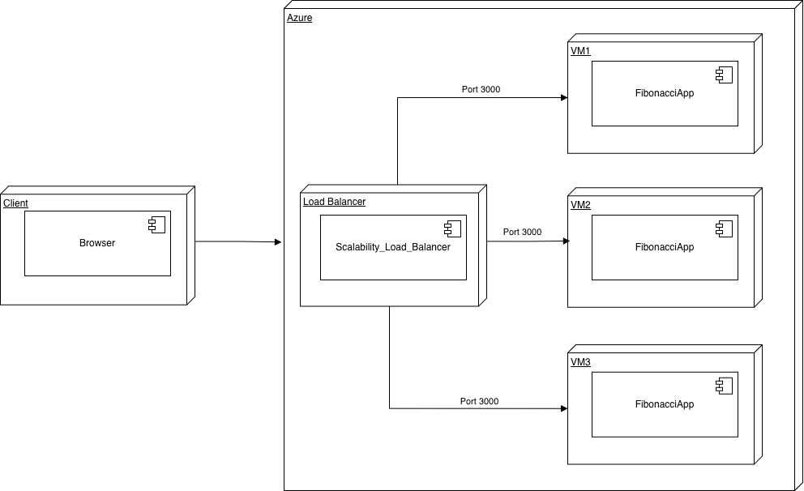
